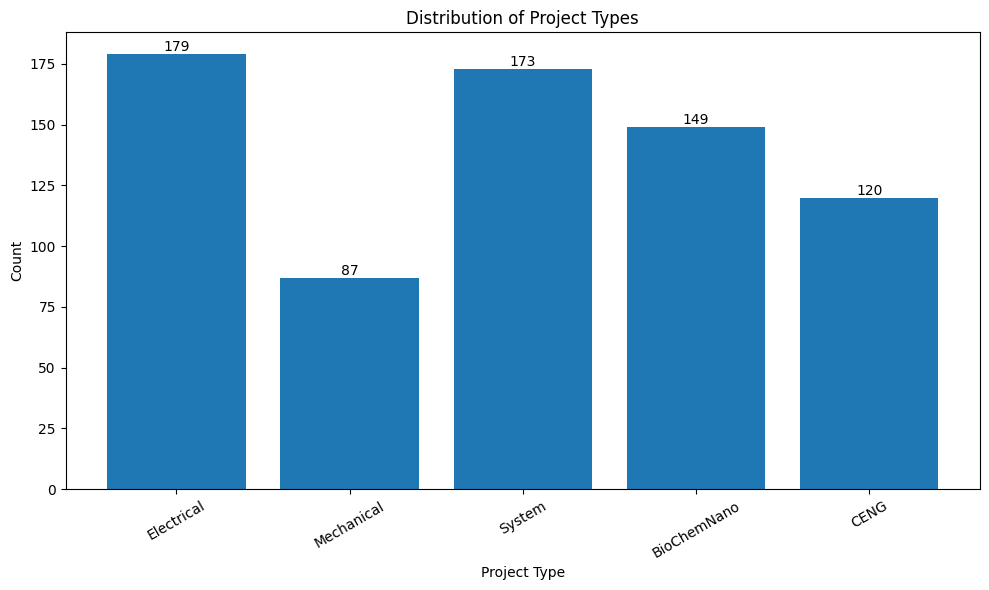
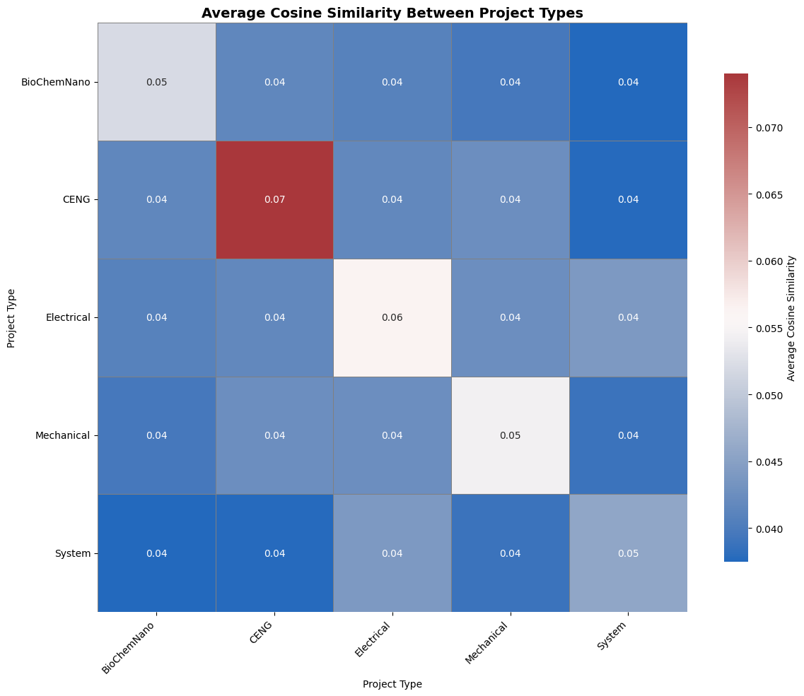
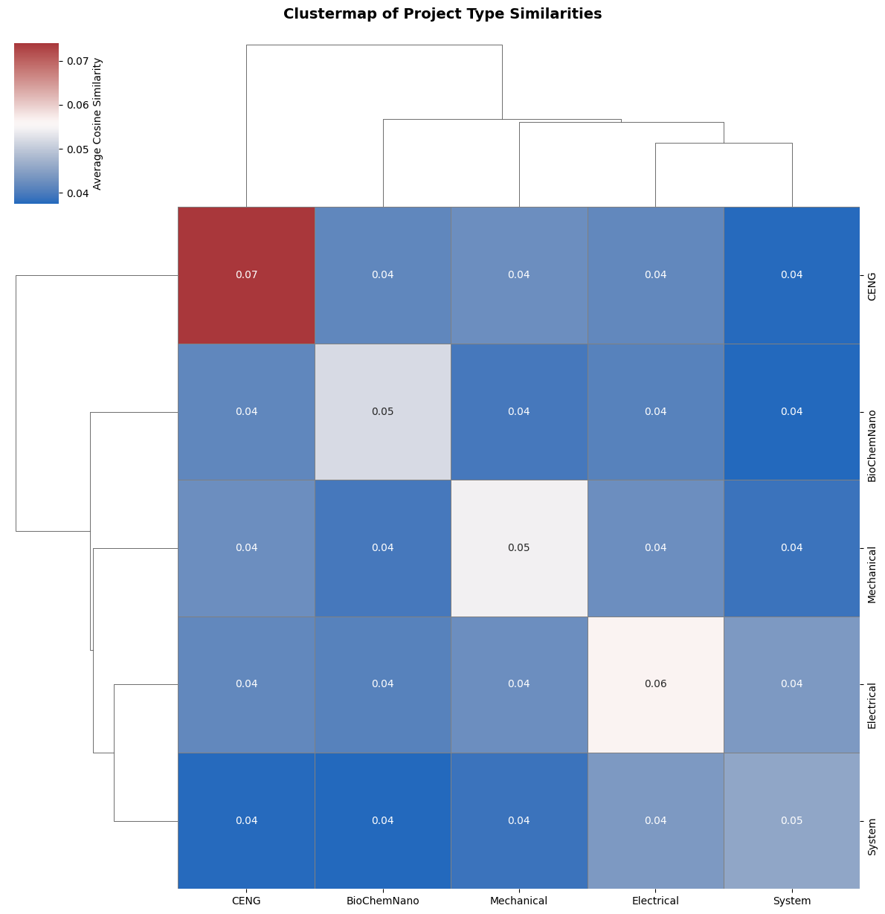
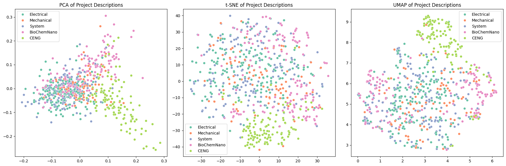

# Capstone Project Ideas Analysis

## Introduction
This is a project into exploring the current trends and themes of engineering projects in different domains, from architectural and civil to electrical and system design. The further vision of this project is to find out a project that can utilize serveral engineering domain together and finding out the skills in demand for the current labor market.

## Source

- [Waterloo Capstone Design Projects from 2024 and 2025](https://uwaterloo.ca/capstone-design/project-abstracts)
- [BCIT Capstone Project From 2020 to 2025](https://www.bcit.ca/energy/research/degree-students-capstone-projects/)

## First glance at the data

At first, there are 753 projects included in this analysis, most of them from Waterloo's Capstone Design Projects.

The actual usable data for this project is 708 projects due to missing description. All of them are from BCIT's capstone project list.

## Keywords analysis
- **Electrical**: data, power, project, time, device, design, sound, sensors, used, allow, water, images, features, control, able, supply, quality, cameras, designed, network, charging, processing, method, bike, monitoring
> 'data' and 'power' suggest the data acquisition system or a project that has intense data handling and processing mechanisms throgh the use of sensors and data analytics. There are projects that related to control or monitor a given entity or surrounding. Most of the **electrical** projects are complex with mutliple inputs and multiple outputs in the digital domain and significantly utilizing signal theory to collect 'features' and 'processing' a desirable output.

- **Mechanical**: design, device, project, solution, designed, time, aims, user, water, using, manual, current, 3d, process, cost, waste, use, existing, improve, efficiency, tool, smart, users, heat, automated
> The **mechanical** design is oftentime start with a 3D modeling to prototype a close reality product. Most of the projects 'aims' to 'improve' the 'efficiency' in all stages, including but not limited to budget, manufacture, delivery and decommissioning. The scope of a **mechanical** project is not limited to modeling, prototyping a product, finalizing and creating manual for user, automating repeatitive tasks, and decommissioning the products.

- **System Design**: real, device, time, data, speech, feedback, using, app, vision, practice, patients, safety, users, cognitive, designed, wearable, uses, computer, tool, user, alerts, sensors, heat, braille, audio
> **System design** projects often include a form of intense data processing architecture, from laying out the proper sensors location and sampling rate to inputing a complex architecture of **machine learning** or **artifical intelligence** in general. The final product are usually a piece of technology that can take user's data, send information packet to a information processing powerhouse and send back to users. They are most likely IoT products that can handle large amount of data and help users visualizing their health or mental status, or their environments

- **Nanotechnology**: energy, water, blood, solar, design, time, device, health, sustainable, detection, current, solution, disease, using, nanoparticles, providing, monitoring, designed, heat, use, based, effective, real, light, aims
> **Nanotechnology** projects are often involved multiple mechanism to detect anomality in their environment, e.g. inside a human body, in a body of water, in the sky. The nanotachnolgy projects have 2 distinctive paths of going into healthcare and helping medical practitioners "hardware realizable" their ideas of exploring the inside body, or going to environment to detect anomolies to help environmental scientists doing their jobs.

- **Mechatronics**: robot, device, user, designed, solution, time, users, safety, autonomous, real, water, vision, aims, project, computer, food, process, provide, plant, help, provides, app, monitoring, conditions, data
> **Mechatronics** projects are often included a robot that specializes in a certain tasks or an 'automous' system that can solve a certain issues. It is closely related to system design problem solving. Additional tasks to a **mechatronics** project are creating manuals for user, engineers and maintainers, monitoring the environment while controling the system, processing mass amount of data, utilizing computational power, and communicating with user about data representation.

- **Management**: students, information, platform, data, making, time, engineering, ai, waterloo, tool, planning, users, decision, reviews, program, options, process, access, offers, high, personalized, real, university, option, clinical
> **Management** projects are usually tools that integrate data analysis, powerful **machine learning** and AI to help users making a quicker and more accurate decision making. At the same, personalize the decision making system to the user's favor. They are more popular to general purpose than fine-tune to a certain industry or domain.

- **Electrical and Computer**: users, data, user, time, using, aims, real, project, solution, app, experience, processing, smart, learning, sensors, mobile, information, power, low, application, ai, designed, based, provides, design
> The same idea with **electrical** projects. While **electrical** projects tend to be on more physical side of sampling and data processing. Computer engineering projects are more involved higher level of data processing with more use of **machine learning** with real-time analysis and bringing more high-end products that incorporate better information visualization, UI, and utilization of AI in a more compact design.

- **Architectural**: community, housing, building, design, new, project, school, centre, energy, ontario, designed, architecture, aims, site, buildings, affordable, waterloo, residential, space, high, facility, city, services, area, toronto
> **Architectural** projects revolves around betterment of a 'community', and involves in solving 'housing' crisis and providing 'facility' for 'residial' ad other 'buildings'. **Architectural** projects focus on providing services and manipulating space with new technology in every iteration of the land.

- **Civil**: housing, design, solution, construction, project, waterloo, cost, sustainable, aims, consulting, building, structural, provide, modular, wildlife, existing, innovative, transportation, ontario, use, improve, city, community, traffic, timber
> While **architectural** projects focus on prodiving space and services to users of all kinds, **civil** projects are involves in 'construction' and bringing 'sustainable' solutions to new and old buildings. **Civil** projects also include analysis on traffic use and transporation, and monitoring the environmental impact on 'wildlife'.

- **Environmental**: water, design, climate, solution, energy, project, consulting, treatment, carbon, aims, emissions, future, hydrogen, sustainable, generation, risk, tailings, city, concrete, improve, ontario, meet, innovative, fish, area
> **Environmental** projects have similar fashion to **civil** projects, but more focus on the environmental side when carrying out a construction or renovation projects. These kind of project focus on climatic and ecological analysis while assessing buidling project against carbon emission standard. They are often long-term projects.

- **Geological**: design, slope, pit, jura, creek, consulting, stability, geological, final, portal, sable, underground, risk, structures, energy, opens, mitigation, assessed, accordingly, community, debris, gg, features, geotechnical, structural
> **Geological** project interests in assess ground conditions before, during, and after carrying out a construction projects. They often include 'geotechnical' and 'structural' analysis on building and evaluating 'underground' and on-ground 'geological' condition for projects.

- **Chemical**: water, project, design, process, energy, waste, carbon, plastic, aims, heat, efficiency, sustainable, used, battery, using, reduce, hydrogen, recycling, gas, cost, scale, power, batteries, environmental, industry
> **Chemical** projects involves acessing and improving the current technology in detecting and solving the 'energy', 'waste', 'water', 'carbon', 'plastic' and 'gas' -related issues. Improving 'efficiency', reduing 'cost', minimize 'environmental' impacts are common goals for **chemical** projects.

- **Biomedical**: patients, patient, device, time, data, early, pressure, users, user, knee, solution, treatment, detection, information, blood, real, aims, sleep, healthcare, injuries, adherence, current, improve, designed, rehabilitation
> **Biomedical** projects often provides solutions that assists the patients in 'treatment', 'early' 'detection', and 'rehabilitation'. These projects are strictly under certain healthcare standards and are backed by professional medical practitioners.

## Grouping together

### Simple grouping

**1. Electrical**
**Categories**: Electrical and Computer, Electrical
**Reason**: Both deal with circuits, sensors, signal processing, and often use embedded systems and real-time computing. "Electrical and Computer" just adds more high-level computation (AI/UI), but it's a natural merge.
**Keywords**: data, users, user, time, project, using, real, power, aims, solution, sensors, experience, app, processing, design, device, learning, smart, designed, information, control, mobile, application, low, safety

**2. CENG**
**Categories**: Civil, Architectural, Environmental, Geological
**Reason**: These fields are all part of infrastructure, land development, and environmental impact analysis. They share goals like urban planning, sustainability, building safety, and construction techniques.
**Keywords**: design, housing, community, building, project, new, water, aims, solution, waterloo, ontario, sustainable, construction, energy, consulting, city, school, provide, existing, innovative, site, structural, sustainability, use, cost

**3. BioChemNano**
**Categories**: Biomedical, Chemical, Nanotechnology
**Reason**: They center around biological or chemical processes, with goals like healthcare, energy efficiency, or material innovation. Nanotech often bridges both biomedical and chemical applications.
**Keywords**: water, project, energy, design, aims, process, solution, time, device, sustainable, using, patients, efficiency, current, patient, carbon, waste, heat, used, blood, treatment, approach, detection, plastic, designed

**4. System**
**Categories**: Mechatronics, System Design,  Management
**Reason**: All three involve complex systems that integrate hardware, software, and user interfaces. "Management" fits if the focus is on decision-support systems or platform development—not traditional project management.
**Keywords**: time, device, real, users, data, user, designed, solution, robot, students, using, information, feedback, safety, app, aims, vision, process, help, platform, food, computer, uses, water, provide

**5.Mechanical**
**Categories**: Mechanical
**Reason**: Mechanical is universally involves in developing and refining the physical components, which belongs to all projects and lack of involvement in digital realms.
**Keywords**: design, device, project, solution, designed, time, aims, user, water, using, manual, current, 3d, process, cost, waste, use, existing, improve, efficiency, tool, smart, users, heat, automated

---

### More complex grouping
Based on the keyword analysis and thematic overlaps, here are grouped categories with reasons for each grouping:

**1. Hardware & Embedded Systems**
**Categories**: Electrical, Mechatronics, Electrical and Computer
**Reason**:
All three fields heavily involve **physical devices**, **sensors**, **data acquisition**, and **control systems**. Electrical focuses on raw data/signal handling; Mechatronics emphasizes robotics and environmental interaction; Electrical and Computer merges these aspects with more advanced **AI and UI/UX design**.

**2. Data-Driven Systems & Intelligent Applications**
**Categories**: System Design, Management, Electrical and Computer (also overlaps here)
**Reason**:
These domains focus on **data collection**, **AI**, **feedback systems**, and **user interaction**. System Design and Management emphasize **data personalization**, **decision-making platforms**, and **user safety or utility**, especially through **apps or platforms** with real-time processing.

**3. Engineering for Environment & Sustainability**
**Categories**: Environmental, Civil, Chemical, Geological
**Reason**:
All these categories are **concerned with sustainability**, **resource management**, and **environmental impact**. Civil and Geological focus on construction/terrain; Environmental and Chemical target **pollution**, **energy efficiency**, and **climate** or **material** concerns.

**4. Health and Medical Technology**
**Categories**: Biomedical, Nanotechnology (partially)
**Reason**:
Both relate to **healthcare solutions**—Biomedical from a **clinical and rehabilitation** standpoint, and Nanotechnology in **diagnostics**, **treatment**, and **monitoring**, particularly at a **molecular or cellular** level.
**5. Infrastructure, Space, and Design**
**Categories**: Architectural, Civil (also overlaps), Geological (partial)
**Reason**:
This group emphasizes **urban planning**, **building design**, and **infrastructure development**. Architectural focuses on **spatial aesthetics and community**, Civil on **construction**, and Geological on **site assessment**.

**6. Smart Manufacturing & Mechanical Optimization**
**Categories**: Mechanical, Mechatronics (partial overlap), Chemical (partial)
**Reason**:
Mechanical engineering emphasizes **efficiency**, **automation**, and **physical design**, often with **3D modeling**. Mechatronics projects involving smart tools and devices overlap here. Chemical engineering also shares the **manufacturing/process optimization** angle, especially for energy and resource management.

**7. Advanced Materials & Nano Solutions**
**Categories**: Nanotechnology, Chemical (partial)
**Reason**:
Both areas explore **material properties**, **microscale processes**, and **novel applications** in **health**, **energy**, and **environmental** systems. They differ in scale but align in **research-driven innovation**.

---

## Document Similarity

The data is balance enough for decision making.

There're amost no overlap on each other, which means the projects are unique even among the same category. Below 5% is commonly a standard for plagiarism. The diversity is proven and thus enhance the variety in engineering applications for real-world problems. Even though the ground disciplines of each engineering domain are different, the application of each engineering projects tends to integrate knowledge and experience from other engineering fields to further refine the final products for commercial use or a specific use.

System group and electrical groups share many similarities together, such as the interest in data handling and processing methods in mass, and design of data acquisision. Mechanical projects is rooted from the creation of physical bodies that interact with the real world, and sending back digital signal for visualization. It shares the drive of solving the real world issues as an end-to-end project with system and electrical groups. The BioChemNano groups stems from the scientific background with vast knowledge in specific understanding of the environmental, medical or mixed. The BioChemNano group are more science-driven, while the Mechanical, System, and Electrical groups are more client-driven. Both are aiming in creating tools and applications for professional practioners to use and evaluate as they are contributing values to society. CENG (civil, environmental, architectural, and geological) group has a diverse background. They are working close to the laws and orders and multiple standards as their projects are meant to serve the public for long-term solutions with far vision in mind. Even though many engineering projects are not meant to serve for long term, but they are always up to a certain standards within their industries' criterion and the local government's safety rules.

The clustering and high dimensional data visualization is here to understand how close projects are together. Many civil group, CENG, projects are more compact together because it is hard to break out of the standard style of a consulting company that offers a solution for their client. Other engineering groups are tend to blend to each other and blur the boundaries of multiple engineering disciplines. Electrical projects are spread everywhere because many projects have to use some form digital sampling and visualization to research and evaluate their own projects. Mechatronics is a combination of electrical and mechanical design with a system design process in mind. BioChemNano group blends in more with System group because of their utilization on data sampling and processing principles along with the intense applications in machine leanring and artificial intelligence.

## Intra-Group vs Inter-Group similarity analysis

> Intra-Group Similarities:
> BioChemNano: 0.052
> CENG: 0.074
> Electrical: 0.056
> Mechanical: 0.054
> System: 0.046
> 
> All Inter-Group Similarities:
> Electrical vs System: 0.044
> System vs Electrical: 0.044
> CENG vs Mechanical: 0.043
> Mechanical vs CENG: 0.043
> Electrical vs Mechanical: 0.043
> Mechanical vs Electrical: 0.043
> CENG vs Electrical: 0.042
> Electrical vs CENG: 0.042
> CENG vs BioChemNano: 0.041
> BioChemNano vs CENG: 0.041
> BioChemNano vs Electrical: 0.041
> Electrical vs BioChemNano: 0.041
> Mechanical vs BioChemNano: 0.040
> BioChemNano vs Mechanical: 0.040
> Mechanical vs System: 0.039
> System vs Mechanical: 0.039
> CENG vs System: 0.038
> System vs CENG: 0.038
> System vs BioChemNano: 0.038
> BioChemNano vs System: 0.038

The similarity data provides valuable insight into the coherence and distinctiveness of the grouped project categories. Among the intra-group similarities, the CENG group (which includes Civil, Environmental, Geological, and Architectural projects) stands out with the highest similarity score of 0.074. This suggests a strong thematic consistency within this category, likely due to the shared focus on infrastructure, environmental impact, and large-scale physical systems. Conversely, the System group exhibits the lowest intra-group similarity (0.046), reflecting the broader diversity of its components, such as System Design, Mechatronics, and Management, which span hardware integration, AI systems, and user-centric platforms. The moderate similarity levels within groups like Electrical (0.056), Mechanical (0.054), and BioChemNano (0.052) indicate a reasonable degree of internal cohesion while still encompassing varied technical themes.

When examining inter-group similarities, the values remain low across the board, with the highest being 0.044 between Electrical and System. This confirms that the groupings are well-differentiated, with minimal overlap in thematic content. Notably, the relationships between CENG and Mechanical (0.043), and Electrical and Mechanical (0.043) point to some shared foundational engineering principles, particularly around physical design and system implementation. On the other end, the lowest inter-group similarities (0.038) between System and both BioChemNano and CENG reflect their clear conceptual divergence. Overall, these results validate the grouping strategy by demonstrating high intra-group consistency and low inter-group redundancy, while also highlighting areas where broader categories (like System) may encompass a wider variety of topics.
